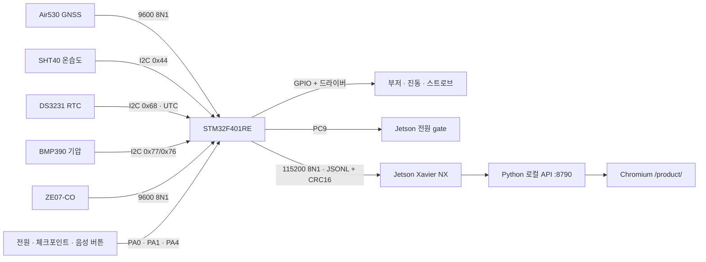

# STM32F401RE ↔ Jetson Xavier NX 센서 연동

이 문서는 `STM32 센서 허브 → Jetson 로컬 서버 → 7인치 제품 화면`을 실제 하드웨어에 올리는 절차다.
인터넷 연결은 실행에 필요하지 않다. 펌웨어와 서버 코드는 구현됐지만 실제 센서·Jetson 결선 검증은
아직 하지 않았다 `[미검증]`.

## 1. 전체 구조



CO 판정과 물리 경보는 STM32에서 끝난다. Jetson 전원이 꺼져도 계속 동작해야 한다. Jetson의
화면 경보음은 보조 출력일 뿐이다.

이 문서의 배선·센서·버튼·전원 gate 실장과 Jetson 연동은 전부 `[미검증]`이다. 주소·핀·시간·대기
값은 현재 펌웨어 구현값이며, 실제 장비에서 정상 동작을 뜻하지 않는다.

## 2. Jetson과 STM32 연결 — USB 방식 권장

### 권장: Nucleo ST-LINK VCP 또는 3.3 V USB-UART

Jetson 40핀 UART는 핀멀티플렉스·콘솔 설정 영향을 받는다. 시연에서는 USB 직렬 장치가 가장 단순하다.

1. Nucleo-F401RE라면 ST-LINK USB를 Jetson에 연결한다. 보통 `/dev/ttyACM0`으로 보인다 `[미검증]`.
2. 별도 USB-UART를 쓰면 **3.3 V TTL** 제품을 사용한다.
3. USB-UART `TX → STM32 PA3(RX)`, `RX ← STM32 PA2(TX)`, `GND ↔ GND`로 연결한다.
4. STM32를 별도 전원으로 구동할 때 USB-UART의 `VCC`는 연결하지 않는다. Nucleo의 USB 전원과 외부
   전원을 함께 쓸 때는 보드 전원 점퍼 설명서를 먼저 확인해 전원을 병렬 연결하지 않는다.

장치 경로는 부팅마다 달라질 수 있는 `/dev/ttyACM0`보다 고정 심볼릭 링크를 우선한다.

```bash
ls -l /dev/serial/by-id/
```

출력된 전체 경로를 `SAFEAID_STM32_PORT`에 넣는다.

### 보조: Jetson 40핀 헤더 직결

두 보드의 UART는 3.3 V 로직만 사용하고, 5 V TTL을 연결하지 않는다.

| Jetson Xavier NX J12 | STM32F401RE | 의미 |
|---|---|---|
| 핀 8 `UART_TX` | PA3 `USART2_RX` | Jetson → STM32 |
| 핀 10 `UART_RX` | PA2 `USART2_TX` | STM32 → Jetson |
| 핀 6 `GND` | `GND` | 공통 접지 |
| 전원 핀 | 연결하지 않음 | 각 보드 전원은 별도 관리 |

JetPack 이미지와 캐리어보드에 따라 `/dev/ttyTHS0` 등 장치명이 달라질 수 있다 `[미검증]`. `Jetson-IO`와
현재 보드 핀맵을 확인한 뒤 사용한다. 그래서 기본 배포 스크립트는 USB 직렬을 기준으로 한다.

## 3. 센서와 STM32 배선

### Air530 GNSS — USART1

Seeed 문서상 모듈 공급 전압은 3.3 V 또는 5 V이고 기본 예제 통신 속도는 9600 baud다 `[출처]`.
이 프로젝트에서는 STM32 로직과 맞추기 위해 3.3 V로 고정한다.

| Air530 Grove 선 | STM32 | 비고 |
|---|---|---|
| 빨강 `VCC` | 3.3 V | 5 V로 올리지 않음 |
| 검정 `GND` | GND | 공통 접지 |
| 노랑 `TX` | PA10 `USART1_RX` | 필수 |
| 흰색 `RX` | PA9 `USART1_TX` | 설정 명령을 쓸 때만 필요 |

실내에서는 fix가 늦거나 실패할 수 있다. 외장 u.FL 안테나를 연결하고 하늘이 열린 장소에서 첫 수신을
검증한다. 제조사 표의 콜드 부팅 시간은 30초다 `[출처]`; 실제 현장 시간은 별도 측정한다 `[미검증]`.

### ZE07-CO — USART6

ZE07-CO 전원과 UART 로직 전압이 다르다. 제조사 문서상 전원은 5~12 V이고 역극성 보호가 없으며,
UART는 0~3.0 V TTL이다 `[출처]`.

| ZE07-CO 핀 | STM32/전원 | 비고 |
|---|---|---|
| 15 `Vin` | 안정된 5 V | 역극성 금지 |
| 5 또는 14 `GND` | GND | STM32와 공통 접지 |
| 8 `TXD` | PC7 `USART6_RX` | 기본 능동 업로드 수신 |
| 7 `RXD` | PC6 `USART6_TX` | 현재 펌웨어에서는 선택 |

제조사 기본 모드는 1초마다 9바이트 농도 프레임을 전송하며 9600 8N1을 사용한다 `[출처]`. 펌웨어는
프레임 체크섬을 확인하고 `ppm = (high × 256 + low) × 0.1`로 계산한다 `[출처]`.

첫 사용 예열은 최소 5분으로 둔다 `[출처]`. 예열 중 값은 화면에서 정상 계측으로 표시하지 않지만,
100 ppm 이상 값이 들어오면 보수적으로 물리 경보를 울린다 `[추정: 안전 편향]`.

> ZE07-CO 제조사는 이 모듈을 인명 안전 시스템에 쓰지 말라고 명시한다 `[출처]`. 현재 구성은 대회용
> 시제품이며 인증 CO 경보기의 대체품이 아니다. 교정가스·센서 고장·전원 단선 시험을 완료하기 전에는
> 안전 장치로 간주하지 않는다.

### SHT40 — I2C1

| SHT40 | STM32 | 비고 |
|---|---|---|
| `VDD` | 3.3 V | |
| `GND` | GND | |
| `SDA` | PB9 | 모듈에 풀업이 없으면 3.3 V 풀업 추가 |
| `SCL` | PB8 | 모듈에 풀업이 없으면 3.3 V 풀업 추가 |

펌웨어는 주소 `0x44`, 고정밀 명령 `0xFD`, 10 ms 대기, 6바이트 읽기를 사용한다 `[출처]`. 두 16비트
값 각각에 CRC-8(poly `0x31`, init `0xFF`)을 확인한다 `[출처]`.

### DS3231 RTC — I2C1

DS3231은 SHT40·BMP390과 같은 I2C1 버스에 연결한다.

| DS3231 | STM32 | 비고 |
|---|---|---|
| `VCC` | 모듈 정격 전원 | 모듈 전압·레벨 시프터 구성 확인 `[미검증]` |
| `GND` | GND | 공통 접지 |
| `SDA` | PB9 | I2C1 공유 |
| `SCL` | PB8 | I2C1 공유 |

펌웨어는 `0x68`의 status register `0x0F`를 먼저 읽어 OSF(bit 7)를 확인한다. OSF가 설정됐거나 I2C
읽기·BCD·날짜 범위 검증이 실패하면 UTC를 만들지 않고 `rtc.valid=false`, `rtc.iso_utc=null`로 보낸다.
즉 RTC 오류를 Jetson 시스템 시간이나 추정 시각으로 덮지 않는다. 유효한 경우에만 ISO 8601 UTC(`Z`)를
내보낸다. 실제 RTC 설정·백업 배터리·OSF 복구 시험은 `[미검증]`이다.

#### RTC 출고·정비 설정

시스템 시각을 자동으로 복사하는 기능은 없다. DS3231을 교체하거나 OSF가 설정된 경우에는 정비자가
검증된 UTC를 수동으로 준비한 뒤, **STM32 직렬 콘솔에서만** 아래 명령을 보낸다.

```text
SET RTC UTC YYYY-MM-DDTHH:MM:SSZ
```

펌웨어는 정확히 이 UTC 형식과 달력 범위를 검증한 뒤에만 DS3231에 기록하고 OSF를 해제한다. 잘못된
형식·로컬 시간·자동 추정 시각은 거부한다. 이 명령은 MAP·LLM HTTP API로 노출하지 않는다. 실제 기록과
전원 손실 뒤 OSF 동작 검증은 `[미검증]`이다.

### BMP390 — I2C1

| BMP390 | STM32 | 비고 |
|---|---|---|
| `VCC` | 모듈 정격 전원 | 모듈 전압 확인 `[미검증]` |
| `GND` | GND | 공통 접지 |
| `SDA` | PB9 | I2C1 공유 |
| `SCL` | PB8 | I2C1 공유 |

펌웨어는 Adafruit BMP3XX 라이브러리로 `0x77`을 먼저, 실패하면 `0x76`을 탐색한다. 5초 간격 읽기와
15초 stale 판정을 분리하며, `pressure_valid=false`일 때 `press_hpa=null`, `press_trend="unknown"`을
보낸다. 1분 간격 표본이 **10분 이상** 쌓인 뒤에만 최소제곱 기울기로 `rising/steady/falling`을 계산하고,
그 전에는 `unknown`이다. 실제 주소·기압 보정·추세 정확도는 `[미검증]`이다.

### 물리 버튼과 Jetson 전원 gate

버튼은 internal pull-up을 쓰는 active-low 입력이며 40 ms debounce를 적용한다.

| STM32 핀 | 버튼/출력 | 펌웨어 동작 |
|---|---|---|
| PA0 | 전원 버튼 | 2초 이상 길게 누른 뒤 release하면 Jetson 정상 종료 요청 |
| PA1 | 체크포인트 버튼 | pressed/released edge와 유지 시간 전송 |
| PA4 | 음성 버튼 | pressed/released edge와 유지 시간 전송 |
| PC9 | Jetson 전원 gate | `HIGH=공급`, `LOW=차단` 가정 |

PC9에 Jetson 전원을 직접 물리지 말고 정격에 맞는 MOSFET/load-switch·풀업/풀다운·역류 방지 회로를 둔다.
실제 gate 극성·전원 시퀀스·복귀 동작은 `[미검증]`이다.

전원 버튼의 현재 프로토콜은 다음과 같다.

1. Jetson gate가 켜진 상태에서 PA0을 2초 이상 길게 누른 뒤 놓으면 STM32가 `shutdown_requested`를 보낸다.
2. `smartaid-power-manager`가 CRC로 검증된 pending을 확인하고 `/api/power/shutdown-ack`를 통해
   `POWER OFF ACK`를 먼저 큐잉한다.
3. STM32가 pending 요청에 대한 ACK를 받으면 `shutdown_ack`를 내보내고 **90초 뒤** PC9 gate를 끈다.
4. ACK 확인 뒤 서비스가 `systemctl poweroff --no-block`을 요청한다. 이 호출이 실패하면
   `/api/power/shutdown-cancel` → `POWER OFF CANCEL`로 예약을 즉시 취소하고 `shutdown_cancelled`를 확인한다.
5. ACK가 없으면 **120초 뒤** `shutdown_timeout`을 내보내고 pending을 취소하며 gate를 유지한다.
6. gate가 꺼진 상태에서 PA0을 놓으면 STM32가 gate를 다시 켠다.

이 절차는 ACK 수신과 예정된 gate 동작을 전달할 뿐, Jetson이 실제로 완전히 종료됐다는 사실을 보장하지
않는다. 실제 전원 차단·복귀 시험은 `[미검증]`이다.

### 경보 출력

| STM32 핀 | 출력 | 필수 구동 회로 |
|---|---|---|
| PB0 | 능동 부저 제어 | NPN 또는 로직레벨 MOSFET + 게이트/베이스 저항 |
| PB1 | 진동 모터 제어 | MOSFET + 모터 역기전력 다이오드 |
| PC8 | 스트로브 제어 | 부하 전류에 맞는 MOSFET |

부저·모터·고휘도 LED를 STM32 GPIO에 직접 연결하지 않는다. 모든 출력은 현재 `HIGH=ON`을 가정한다
`[출처: 펌웨어]`. 실제 드라이버가 active-low면 펌웨어 극성을 바꾼 뒤 무부하부터 검증한다.

## 4. STM32 빌드와 업로드

펌웨어 위치:

```text
OGTECH-embedded/stm32_smart_tray_controller/stm32_smart_tray_controller.ino
```

STM32duino 코어가 설치된 Arduino CLI 예시는 다음과 같다. FQBN은 Nucleo-F401RE 기준이다.

```bash
cd OGTECH-embedded
arduino-cli lib install "Adafruit BMP3XX Library@2.1.6"
arduino-cli compile \
  --fqbn STMicroelectronics:stm32:Nucleo_64:pnum=NUCLEO_F401RE \
  stm32_smart_tray_controller
arduino-cli upload \
  --fqbn STMicroelectronics:stm32:Nucleo_64:pnum=NUCLEO_F401RE \
  -p <ST-LINK 또는 업로드 포트> \
  stm32_smart_tray_controller
```

현재 빌드 결과는 플래시 **55,600 B (10%)**, 전역 RAM **6,020 B (6%)**다
`[실측: Nucleo F401RE compile, 2026-08-19]`. 실제 보드 업로드와 센서·RTC·버튼·
전원 gate 입출력은 아직 검증하지 않았다
`[미검증]`.

시리얼 모니터는 `115200 8N1`로 연다 `[출처: 펌웨어]`. 1초마다 아래와 같은 한 줄 JSON이 나와야 한다.

```json
{"v":1,"event":"telemetry","seq":123,"uptime_ms":456000,"gps":{"fix":true,"lat":37.5435,"lon":127.0767,"acc_m":null,"hdop":0.9,"sats":11,"age_s":0.2},"rtc":{"valid":true,"iso_utc":"2026-08-19T00:00:00Z","age_s":0.1},"env":{"valid":true,"sht_valid":true,"pressure_valid":true,"temp_c":23.45,"humidity_pct":58.20,"press_hpa":1007.4,"press_trend":"falling","age_s":0.1,"press_age_s":0.1,"bmp_address":119},"co":{"valid":true,"warming_up":false,"ppm":3.2,"level":"normal","alarm":false,"age_s":0.1},"power":{"valid":false,"percent":null,"days_left":null,"jetson_gate_on":true,"shutdown_pending":false},"crc16":"ABCD"}
```

CRC16 값은 앞의 JSON 내용에 따라 달라진다. Jetson은 `CRC-16/CCITT-FALSE`가 맞지 않는 줄을 버린다.
`press_trend`는 `rising/steady/falling/unknown`만 허용한다. `pressure_valid=false`이면 기압은
`데이터 없음`, 추세는 `unknown`으로 유지한다. RTC도 `rtc.valid=false`이면 UTC를 사용하거나 표시하지 않는다.
위 JSON은 형식 예시이며 실제 센서 값·주소·CRC는 장비 검증 전까지 모두 `[미검증]`이다.

지원 명령:

```text
PING
STREAM ON
STREAM OFF
GET_TELEMETRY
GET_FIX
ALERT TRAIL ON
ALERT TRAIL CAUTION
ALERT TRAIL OFF
POWER OFF ACK
POWER OFF CANCEL
POWER STATUS
SET RTC UTC YYYY-MM-DDTHH:MM:SSZ
```

## 5. Jetson에 파일 설치

사용자가 옮겨야 하는 폴더는 세 개다.

```text
OGTECH-llm/MAP/
OGTECH-llm/Co-LLM/
OGTECH-embedded/stm32_smart_tray_controller/   # 재플래시·참조용
```

Jetson에서 Python 환경을 준비한다.

```bash
cd /opt/safeaid/MAP
python3 -m venv .venv
. .venv/bin/activate
python -m pip install --no-index --find-links wheels -r requirements.txt
chmod +x jetson/start-map.sh jetson/start-kiosk.sh

cd /opt/safeaid/Co-LLM
python3 -m venv .venv
. .venv/bin/activate
chmod +x scripts/07_product_voice.sh scripts/08_device_monitor.sh scripts/09_physical_voice.sh
```

`wheels/`는 인터넷이 되는 같은 아키텍처 환경에서 미리 준비해야 한다. 네트워크 설치를 허용하는 초기
준비 단계라면 `python -m pip install -r requirements.txt`를 사용할 수 있다.

한국 시연에서는 시스템 시간대를 먼저 맞춘다.

```bash
sudo timedatectl set-timezone Asia/Seoul
timedatectl
```

일출·일몰은 GPS 좌표와 로컬 날짜·시간으로 계산한다. GPS만으로 정치적 시간대 경계를 확정할 수 없으므로,
다른 지역으로 이동할 때는 시스템 시간대 또는 `SAFEAID_UTC_OFFSET_MIN`을 현지 값으로 바꿔야 한다.

## 6. 수동 실행

```bash
cd /opt/safeaid/MAP
export SAFEAID_STM32_PORT=/dev/serial/by-id/<실제-장치-ID>
export SAFEAID_UTC_OFFSET_MIN=540
./jetson/start-map.sh
```

다른 터미널에서 상태를 확인한다.

```bash
curl -s http://127.0.0.1:8790/api/health
curl -s http://127.0.0.1:8790/api/device | python3 -m json.tool
```

제품 화면:

```text
http://127.0.0.1:8790/product/
```

개발자 지도 변환 도구는 기존대로 `http://127.0.0.1:8790/`에 남아 있다.

키오스크 실행:

```bash
./jetson/start-kiosk.sh
```

`--autoplay-policy=no-user-gesture-required`는 브라우저 CO 보조 경보음을 위해 사용한다 `[출처: 실행 스크립트]`.
물리 경보는 이 옵션과 무관하게 STM32에서 작동한다.

### STM32 직렬 단선·지연 연결 저하 부팅

`jetson/start-map.sh`는 STM32 직렬 포트가 부팅 시 아직 없어도 서버를 종료하지 않는다. `app.py`를
`--gps-mode stm32`로 계속 실행하면 `GpsService`가 2초 간격으로 해당 포트 연결을 재시도한다. 그동안
`/product/`는 GPS fix·센서를 회색 대기 상태로 표시하며 위치를 추정하지 않는다. 포트가 나타난 뒤에는
`STREAM ON`으로 정상 텔레메트리를 다시 받는다.

이 저하 부팅은 센서 없이 정상이라고 판정하는 기능이 아니다. `/api/device`에서 `gps.connected=false`,
`gps.fix=false`와 오류 원인을 확인하고, 실제 인수에서는 직렬 포트 연결 뒤 live 센서·GPS 상태가 전이된
증거를 별도로 기록한다.

## 7. systemd 자동 시작

예시 파일은 `MAP/jetson/`과 `Co-LLM/jetson/`에 있다. 설치 위치와 서비스 사용자 이름이 다르면 먼저
파일을 수정한다. 다음 순서는 MAP API를 먼저 준비하고, 그 API에 의존하는 전원·물리 음성·선제 음성
서비스를 올린 뒤 키오스크를 마지막에 시작한다.

```bash
sudo install -d /etc/safeaid
sudo install -m 0644 jetson/map.env.example /etc/safeaid/map.env
sudo install -m 0644 /opt/safeaid/Co-LLM/jetson/audio.env.example /etc/safeaid/audio.env
sudo install -m 0644 jetson/smartaid-map.service /etc/systemd/system/
sudo install -m 0644 jetson/smartaid-power-manager.service /etc/systemd/system/
sudo install -m 0644 /opt/safeaid/Co-LLM/jetson/smartaid-physical-voice.service /etc/systemd/system/
sudo install -m 0644 /opt/safeaid/Co-LLM/jetson/smartaid-device-monitor.service /etc/systemd/system/
sudo install -m 0644 jetson/smartaid-kiosk.service /etc/systemd/system/
sudo systemctl daemon-reload
sudo systemctl enable --now smartaid-map.service
sudo systemctl enable --now smartaid-power-manager.service
sudo systemctl enable --now smartaid-physical-voice.service
sudo systemctl enable --now smartaid-device-monitor.service
sudo systemctl enable --now smartaid-kiosk.service
```

로그:

```bash
journalctl -u smartaid-map.service -f
journalctl -u smartaid-power-manager.service -f
journalctl -u smartaid-physical-voice.service -f
journalctl -u smartaid-device-monitor.service -f
journalctl -u smartaid-kiosk.service -f
```

직렬 포트 권한 오류가 나면 서비스 사용자에게 해당 배포판의 직렬 그룹 권한을 준다. Ubuntu에서는 보통
`dialout`이지만 실제 장치 소유 그룹을 `ls -l`로 확인한 뒤 적용한다 `[미검증]`.

## 8. 화면 기능

- `POSITION`: 실시간 좌표 fix, 위성 수, 경과 시간, 정확도. Air530이 미터 정확도를 직접 주지 않으면
  `±—`로 표시한다.
- `DAYLIGHT LEFT`: 현재 좌표의 일출·일몰을 완전 오프라인으로 계산한다. 베이스캠프 경로 거리,
  보행 속도 `0.8 m/s`, 안전 여유 `30분`으로 귀환 권고 시각을 계산한다
  `[추정: 현장 실측 전 기본값]`.
- `TRAIL`: 보행로 **선분**까지의 거리와 GPS 정확도를 함께 보고 이탈을 판정한다. 기본 임계는 30 m다
  `[추정: 현장 실측 전 기본값]`.
- `ENVIRONMENT`: SHT40 온도·습도와 CO ppm을 표시한다.
- `목적지`: 누른 뒤 지도를 터치하면 좌표를 저장하고 지도 엔진이 경로를 계산한다.
- `체크포인트`: 현재 live fix를 저장한다. fix가 없으면 저장하지 않는다.
- `베이스캠프`: 처음 누르면 현재 live fix를 저장하고, 이후에는 저장 지점과 귀환 경로를 불러온다.

저장 지점은 `runtime/waypoints.json`에 남으며 Git에서 제외된다. 실제 GPS 트랙은 커밋하지 않는다.

향후 LLM은 `GET /api/waypoints`로 저장 지점을 읽고 `POST /api/waypoints`의 `select`만 호출하도록 연결할
수 있다. 좌표·거리·방위·경로·귀환 시각을 LLM이 생성하는 API는 없다.

## 9. CO 경보 기준

현재 펌웨어 기준:

- 주의: 35 ppm 이상 3분 지속 또는 최근 10분 최저값 대비 20 ppm 상승 `[추정: 프로젝트 안전 기준]`
- 경보: 100 ppm 이상 즉시 `[추정: 프로젝트 안전 기준]`
- 추가 경보: 70 ppm/60분, 150 ppm/10분, 400 ppm/4분 지속 `[출처: 프로젝트 고정 기준]`
- 해제: 센서가 30 ppm 미만을 30초 연속 보고할 때 `[추정: 래치 해제 기준]`

센서가 끊기면 이미 발생한 STM32 경보 래치를 임의로 해제하지 않는다. 실제 교정가스 시험에서 오경보·검출
지연·래치 해제를 측정해 임계값을 다시 확정해야 한다 `[미검증]`.

## 10. 실장 검증 체크리스트

- [ ] Air530 NMEA 체크섬 정상, 야외 cold fix 시간 기록
- [ ] GPS 미수신 시 마지막 좌표와 경과 시간만 표시, 방위·거리 숨김
- [ ] 화면에 위성 수와 `±m` 또는 `±—`가 항상 함께 표시
- [ ] SHT40 온습도와 기준 계측기 비교
- [ ] BMP390 기압과 기준 계측기 비교, `press_trend` 전이 확인
- [ ] ZE07-CO 5분 예열 중 화면이 `예열`로 표시
- [ ] 인증 교정가스로 CO 주의·경보·해제 시험
- [ ] **Jetson 전원을 끈 상태에서** 부저·진동·스트로브 경보 확인
- [ ] 직렬 케이블 분리 후 화면이 3초 안에 회색/연결 끊김으로 전환
- [ ] 케이블 재연결 후 2초 재연결 루프가 자동 복구
- [ ] STM32 포트 없이 저하 부팅한 뒤 `/product/`의 회색 대기 상태와 `/api/device`의 `connected=false` 확인
- [ ] 저하 부팅 뒤 STM32를 연결해 `connected=true`, live 텔레메트리 수신으로 전이하는지 확인
- [ ] 현장 보행으로 트레일 임계·GPS 정확도 경계 판정 조정
- [ ] 베이스캠프 저장 → 경로 → 일몰/귀환 권고 시각 확인
- [ ] 네트워크 케이블을 뽑고 20회 연속 부팅·시연

## 제조사 자료

- [Seeed Grove GPS Air530 문서](https://wiki.seeedstudio.com/Grove-GPS-Air530/)
- [Winsen ZE07-CO 사용자 설명서](https://www.winsen-sensor.com/d/files/manual/ze07-co.pdf)
- [Sensirion SHT4x 데이터시트](https://sensirion.com/media/documents/33FD6951/6555C40E/Sensirion_Datasheet_SHT4x.pdf)
- [NVIDIA Jetson Xavier NX 시작 문서](https://developer.nvidia.com/embedded/learn/get-started-jetson-xavier-nx-devkit)
